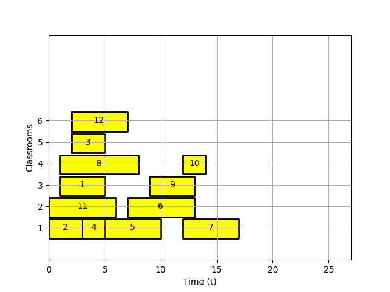
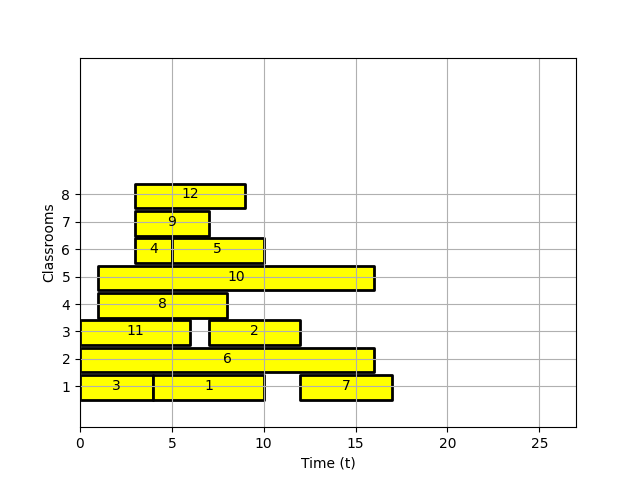

# Registrar
Given a list of class times `[c1,c2, ..., cn]` we wish to find the number of classrooms needed for no overlap to occur. 


### Assumptions
- Input given in json format with list of class times
- Each class time has the format `[start, end]` with `start < end`. The units of each of the values must be the same for
all class times. Note that in the case of floating point values things could get funky. 


### Algorithm
The algorithm is very simple. We simply sort with respect to start times and assign as many classes to a new classroom 
such that there is no overlap. If there are still unassigned classrooms then a new classroom is made available. For pseudocode 
see the included document `scheduler.pdf`.


### Run Guide:
There are no dependencies for the project other than matplotlib 3.3+.
The input for the program must be specified in JSON format as shown below. Note that the third argument is a label used 
for plotting. For example we could denote the classname here. 
```console
foo@bar:~$ cat registrar/data/inputs/input.json
{
  "times":
    [
      [1,5,"1"],
      [0,3,"2"],
      [2,5,"3"],
    ]
}%     
    
```
To run the program against your own configuration, simply provide the relative path to the JSON file from the repository directory using flag `-f`.
```console
foo@bar:~$ python registrar/main.py -f $relative_path
```


## Examples
We now show two examples with configuration files `data/inputs/example_1.json` and `data/inputs/example_2.json`. 

### Example 1) 

```console
foo@bar:~$ cat data/inputs/example_1.json                         
{
  "times":
    [
      [1,5,"1"],
      [0,3,"2"],
      [2,5,"3"],
      [3,5, "4"],
      [5,10, "5"],
      [7,13, "6"],
      [12,17, "7"],
      [1,8, "8"],
      [9,13, "9"],
      [12,14, "10"],
      [0,6, "11"],
      [2,7, "12"]
    ]
}%    
```
### Output
```console
foo@bar:~$ python registrar/main.py -f data/inputs/example_1.json 
Number of classrooms required: 6 
```



### Example 2) 


```console
foo@bar:~$ cat data/inputs/example_2.json 
{
  "times":
    [
      [4,10,"1"],
      [7,12,"2"],
      [0,4,"3"],
      [3,5, "4"],
      [5,10, "5"],
      [0,16, "6"],
      [12,17, "7"],
      [1,8, "8"],
      [3,7, "9"],
      [1,16, "10"],
      [0,6, "11"],
      [3,9, "12"]
    ]
}%   
```
### Output
```console
foo@bar:~$ python registrar/main.py -f data/inputs/example_2.json
Number of classrooms required: 8

```



